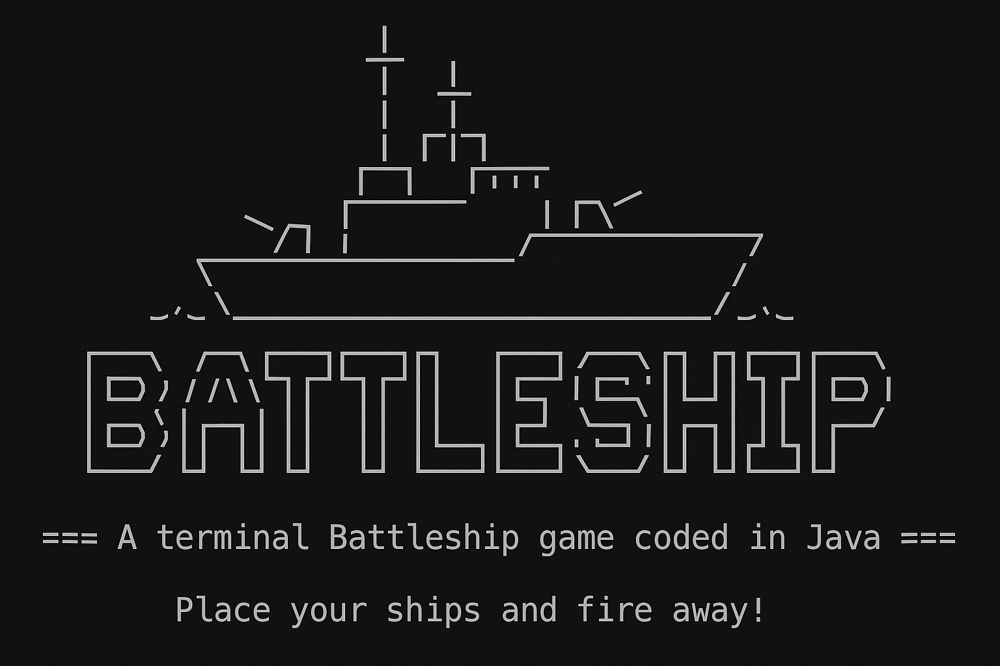

<div align="right">
    
    
    
</div>




---
## 🚢 Présentation

Bienvenue dans **Battleship Java**, un jeu de bataille navale en ligne de commande pour deux joueurs, développé en Java. Préparez votre flotte, planifiez vos tirs... et que le meilleur stratège l'emporte !

---

## 🎮 Fonctionnalités

* ⚔️ Jeu à 2 joueurs en local, en mode tour par tour
* 🌫 Brouillard de guerre pour masquer la flotte ennemie
* 🛠 Placement des navires avec détection d'erreurs (chevauchement, bordure, mauvaise longueur...)
* 💥 Tirez sur la grille ennemie et découvrez immédiatement si vous avez touché, manqué ou coulé un navire
* 📢 Messages d'erreurs clairs grâce à des exceptions personnalisées

---

## 📦 Télécharger le jeu

⭐ Pensez à mettre une étoile au projet si vous l'appréciez !

👉 Cliquez ici pour récupérer la dernière version prête à jouer :

**➡️ [Battleship.jar – Version 1.0.0](https://github.com/ScrimaliAnthony/battleship-java/releases/latest)**

---

## ▶️ Comment jouer

1. Assurez-vous que Java est installé :

```bash
java -version
```

2. Lancez le jeu depuis un terminal avec :

```bash
java -jar Battleship.jar
```

3. Suivez les instructions à l'écran pour placer votre flotte, passer le tour et attaquer votre adversaire.

---

## 💠 Pour les développeurs

### 🗂 Structure du projet :

```
src/
├── battleship/app/         → Lancement du jeu (Main.java)
├── battleship/model/       → Modèle (Ship, Player, Board...)
├── battleship/utils/       → Conversions et validations
├── battleship/ui/          → Affichage console
└── battleship/exceptions/  → Exceptions personnalisées
```

### 🔨 Compilation manuelle :

```bash
javac -d out $(find src -name "*.java")
jar cfm Battleship.jar manifest.txt -C out .
```
